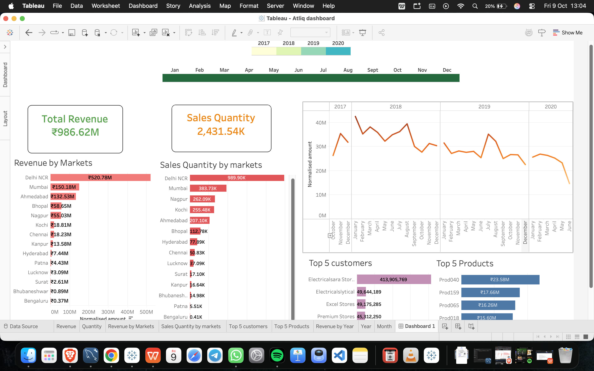

# Atliq Sales Analytics Dashboard

## Project Overview

This project explores sales data using SQL and Tableau to analyze sales performance across markets, products, customers, and time periods.

## Objectives

- Analyze revenue and sales quantity across different markets.
- Examine revenue trends over time.
- Identify the top-performing products and customers.
- Use SQL queries to extract insights from the sales database.
- Present findings through an interactive Tableau dashboard.

## Tools & Technologies

- **SQL:** Data querying, filtering, aggregation, and joins.
- **Tableau:** Data visualization and dashboard development.
- **MySQL:** Database storage and querying.

## Dashboard Preview



## Project Structure

```text
Atliq-Sales-Analytics/
├── README.md
├── sql/
│   ├── db_dump.sql
│   └── sales-queries.sql
└── tableau/
    ├── Atliq dashboard.twbx
    └── dashboard_preview.png
```

## How to Explore

1. Review the SQL scripts in the `sql/` directory.
2. Open `tableau/Atliq dashboard.twbx` in Tableau Desktop to explore the dashboard.
3. Use the dashboard preview above to see the visualizations.

**Note:** The Tableau workbook uses a MySQL database connection. You may need to configure the data source on your machine before the workbook will work.

## Attribution

This project uses a sales dataset and queries associated with the Atliq sales analytics learning project. Please refer to the original dataset or tutorial source for applicable attribution and usage terms.